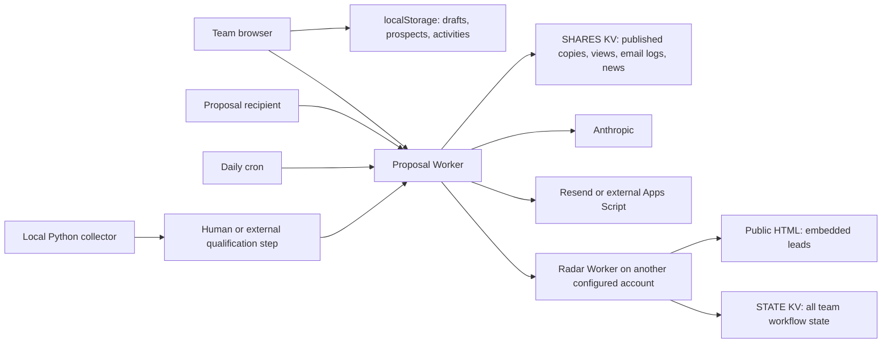
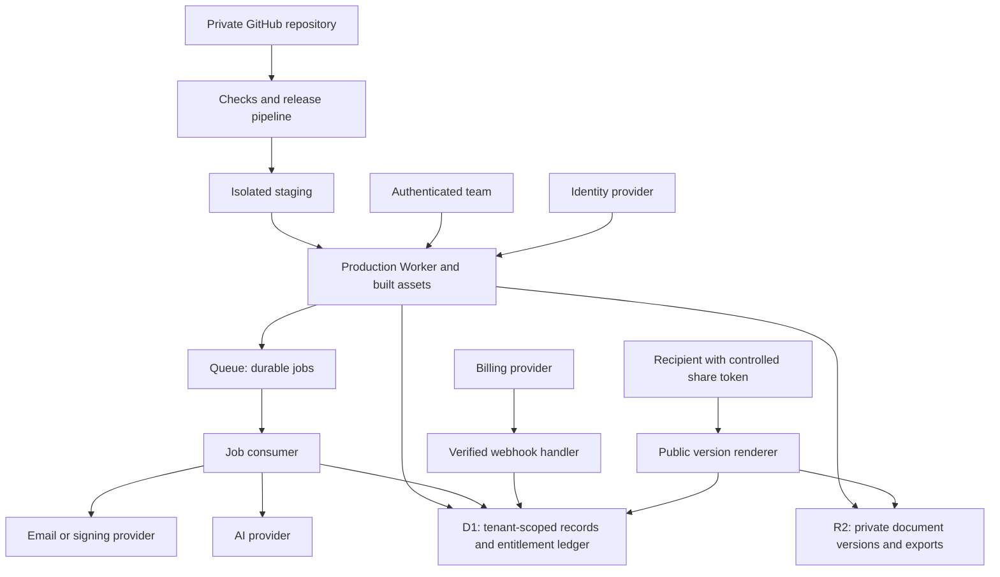

# IPTalons: GitHub, Cloudflare, and paid-product readiness

Prepared 8 September 2026. Scope: the local source tree at `/Users/harsha/iptalons-proposals`, both Workers, browser application, Python ingestion script, configurations, dependency lockfile, and commercial claims embedded in the interface.

**Recommendation:** retain Cloudflare and the useful proposal workflow. Establish a private, business-owned GitHub repository, then replace the prototype’s identity, persistence, publishing, and background-job foundations before onboarding paying organizations. Sell a narrowly defined proposal-and-outreach workspace first. The code does not justify selling an operational research-compliance system.

The important distinction is between **software that sells research-security services** and **software that performs research-security compliance**. This repository is primarily the former. Its descriptions of CSR, RedBook, Grant Hopper AI, researcher training, ORCID integration, and compliance attestations are sales content; their underlying systems are not implemented here.

**What this study establishes.** Source inspection and isolated handler probes support the findings below. A clean locked dependency install succeeded; a Worker deployment dry run succeeded; TypeScript validation failed. No production deployment, GitHub publication, credential rotation, live customer-data inspection, email delivery, billing transaction, or authenticated production audit was performed. Provider configuration, external certifications, contractual rights, actual revenue, and existing production state remain unverified. A dry run proves bundling, not that live bindings, permissions, domains, or secrets work.

## 1. What exists and what is reusable

The folder is not currently a Git checkout: `git status` reports “not a git repository.” This establishes the state of this copy, not whether another copy exists on GitHub. There is no root README, CI workflow, database migration directory, or test suite in the supplied tree. No applicable `AGENTS.md` was found inside it.

| Area | Actual implementation | Readiness and reuse |
| --- | --- | --- |
| Main application | React 18 development UMD scripts, Babel compilation in the browser, global JSX files | Reuse layout and components; introduce a normal production build |
| Proposal creation | Prospect selection, bundled services, quantities, prices, AI-written introduction and savings narrative | Useful workflow; move validation and authoritative pricing to server |
| Proposal editing | Local state, activities, ownership labels, follow-ups, preview and browser print | Reuse UI; replace persistence and identity assumptions |
| Customer records | `localStorage` proposals and prospects, populated with sample records by default | Insufficient for a paid team workspace |
| Publishing | Authenticated snapshot write to KV; public token URL | Working mechanism with major confidentiality/versioning defects |
| Email | Resend, or external Apps Script fallback | Real integration code; configuration and delivery not verified |
| Demand Radar | Second Worker; leads embedded in public HTML; shared workflow state in one KV key | Useful curated starting dataset and workflow; not a production ingestion service |
| News | Authenticated ingest endpoint plus Python collection script | Partial pipeline; qualification and scheduling are external/manual |
| Daily digest | Worker cron, Radar fetch, share scans, email dispatch | Working orchestration code with retry and accuracy gaps |
| Signing | Timers, success message, randomly generated apparent envelope identifier | Demonstration only |
| Team / SSO | Hardcoded team; SSO buttons show placeholder alert | No membership, role enforcement, or SSO implementation |
| Analytics | Local proposal calculations plus illustrative website/advertising numbers | Mixed real/local/sample metrics; definitions need rebuilding |
| SaaS subscriptions | No checkout, billing webhook, subscriptions, or entitlements | Absent |
| Compliance execution | Descriptions in proposals and trust page | Absent from this repository |

Evidence entry points: [application shell](/Users/harsha/iptalons-proposals/public/ip-app.jsx:213), [screens](/Users/harsha/iptalons-proposals/public/ip-screens.jsx:4), [catalog](/Users/harsha/iptalons-proposals/public/ip-components.jsx:245), [main Worker](/Users/harsha/iptalons-proposals/src/worker.ts:442), [Radar Worker](/Users/harsha/iptalons-proposals/csr-demand-radar/src/index.js:1).

The most useful asset is the end-to-end sales workflow: signal → prospect → service bundle → tailored proposal → recipient link → follow-up. Keep that coherence. Converting this into a generic CRM, ad analytics suite, compliance records system, and autonomous lead generator at once would make the launch substantially harder.

## 2. Current architecture and where truth lives



There are three conflicting sources of business truth: browser records, published KV snapshots, and Radar state. Publishing does not make the browser database a synchronized team database. The share-list response returns summaries, not an authoritative draft collection. A colleague cannot reliably resume another colleague’s unpublished work on a fresh device.

The two Wrangler configurations identify different Cloudflare accounts. The main Worker calls the Radar through a hardcoded public `workers.dev` origin and a shared password. This creates separate ownership, credential, deployment, and recovery dependencies. Consolidate into one business-controlled account if the ownership arrangements allow it; otherwise explicitly document and secure the cross-account boundary.

The Python collector also depends on machine-specific token discovery under the user’s home directory. The Apps Script mailer implementation is not included. Neither dependency becomes reproducible merely by uploading this folder to GitHub.

## 3. Findings that should block a public paid launch

Priorities below reflect launch impact, not a formal penetration-test severity score. “Confirmed” means demonstrated in source or an isolated probe; it does not mean verified exploitation of the deployed service.

**F01 — Critical: unauthenticated use of the server’s AI credential.** `/api/claude` dispatches before the authenticated API guard. Its handler accepts the server `ANTHROPIC_API_KEY` without checking a session, organization, subscription, or quota. An anonymous caller with a valid message body can reach the AI provider if that secret is configured. CORS would not stop a direct HTTP client. The local probe confirmed this with a fake server key and mocked provider. [Route](/Users/harsha/iptalons-proposals/src/worker.ts:453), [key selection](/Users/harsha/iptalons-proposals/src/worker.ts:741).

Fix before enabling platform-funded AI: authenticate, resolve membership, authorize operation, enforce a transactional budget reservation, bound input/output size, then call the provider. Rate limits should cover account, organization, and abuse signals. A per-IP rule alone will penalize shared office networks and will not enforce a subscription allowance. Add a server-side kill switch and a provider account spending ceiling where supported.

**F02 — Critical: public shares disclose internal proposal fields.** The publish endpoint accepts the complete proposal object. The public HTML embeds that same object in `window.__SHARE__`. Internal `activities`, note contents, owner metadata, and nested Radar notes can therefore reach recipients even when the preview component never displays them. The probe verified a note marker in the returned HTML. Escaping `<` prevents one script-injection route but does not remove confidential data. [Publish](/Users/harsha/iptalons-proposals/src/worker.ts:515), [serialization](/Users/harsha/iptalons-proposals/src/worker.ts:685), [note storage](/Users/harsha/iptalons-proposals/public/ip-screens.jsx:594).

Create an explicit allowlist of public fields and a separate published-document schema. Generate that schema on the server from an authorized proposal/version. Never forward the full editor object to a recipient. Review existing published snapshots before migration; changing only the visual template will not fix the disclosure.

**F03 — Critical for multiple customers: no organization isolation.** There are no users, memberships, organization IDs, ownership filters, or tenant-scoped keys. Every authenticated person effectively shares the same authority. The UI supplies arbitrary names while the server checks only the shared password. Every authenticated share-list request returns all shares. [Authentication](/Users/harsha/iptalons-proposals/src/worker.ts:461), [list](/Users/harsha/iptalons-proposals/src/worker.ts:551).

Do not introduce subscription checkout until resources can be scoped to a server-verified organization. Merely prefixing frontend routes with an organization slug is insufficient: authorization must apply to every read, write, export, job, AI operation, and provider callback.

**F04 — High: predictable proposal IDs overwrite another browser’s published document.** New IDs are derived from `proposals.length + 1`. Two browsers can independently generate the same ID. KV indexes shares under `byprop:<proposalId>`, and republishing updates the old share in place. The probe demonstrated a second client replacing the first client behind the same public link. This can happen within the current shared team, before any multi-tenant launch. [ID generation](/Users/harsha/iptalons-proposals/public/ip-app.jsx:395), [lookup and overwrite](/Users/harsha/iptalons-proposals/src/worker.ts:525).

Use server-generated immutable IDs; keep human-readable proposal numbers separately with a per-organization uniqueness constraint. Tie each public link to a specific immutable version. Publishing an amendment should be an explicit action with a revision history.

**F05 — High: paid customers’ drafts are browser data.** Clearing storage, changing browser profile, switching computer, or moving to a new domain can make working records disappear from the user’s experience. Logout removes the local auth marker but leaves business data and any browser API key. Local data is not namespaced by verified user or organization. Multiple tabs can overwrite divergent local snapshots. [Persistence and logout](/Users/harsha/iptalons-proposals/public/ip-app.jsx:215).

Persist proposals, prospects, activities, settings, and memberships in a database. Make local storage a disposable cache. Migration must collect each relevant browser’s records; server KV exports will not recover unpublished drafts.

**F06 — High: demo logic silently changes real dates.** `freshenFollowUps()` runs on both sample and saved proposals. Every sufficiently overdue follow-up is moved to roughly 7–10 days ago, then the result is persisted. The probe verified this on an arbitrary non-demo record. Sales history becomes inaccurate without a user action. [Function](/Users/harsha/iptalons-proposals/public/ip-components.jsx:367), [application](/Users/harsha/iptalons-proposals/public/ip-app.jsx:228).

Keep synthetic freshness logic exclusively in isolated demo fixtures. Never modify customer event dates to improve the appearance of a dashboard.

**F07 — High: commercial claims exceed the demonstrated system.** The trust page asserts SOC 2 and ISO certification dates, FedRAMP progress, AWS KMS, MFA/SSO, US-only processing, a 24/7 SOC, named monitoring vendors, and backup/SLA commitments. None of these controls or supporting evidence is established by this code. The shared proposal also includes “inherited via Cloudflare” certification language. Existing external company certifications may exist, but they require separate evidence and exact scope. [Trust page](/Users/harsha/iptalons-proposals/public/ip-screens.jsx:316), [shared trust text](/Users/harsha/iptalons-proposals/public/ip-components.jsx:90).

Cloudflare publishes its own compliance resources; those are vendor evidence, not proof that this application holds the same certifications. Replace unsupported claims with a factual statement of implemented controls and available evidence. Create a claim register with an owner, supporting document, applicable product, and review date. [Cloudflare compliance resources](https://www.cloudflare.com/trust-hub/compliance-resources/).

**F08 — High: electronic signing is simulated.** The button waits, reports success, invents a DocuSign-like identifier, and updates local status. There is no provider envelope creation or callback. The UI nevertheless promises an email, audit logging, and a legally binding process. [Simulation](/Users/harsha/iptalons-proposals/public/ip-screens.jsx:220), [status update](/Users/harsha/iptalons-proposals/public/ip-app.jsx:471).

Either remove this from the paid scope and label it as unavailable, or implement a signing provider end to end. Separate “proposal emailed,” “signature requested,” “recipient viewed,” and “signed” as different events. A clicked button must never stand in for a provider-confirmed action.

**F09 — High: KV read-modify-write loses updates.** Public views, proposal refreshes, and email logs rewrite the whole share record. Radar updates rewrite the entire team state under `state:v1`. The probe produced one additional recorded view from two concurrent requests. Concurrent edits can also overwrite newer content; a delayed snapshot write can conflict with deletion. [View write](/Users/harsha/iptalons-proposals/src/worker.ts:670), [Radar mutation](/Users/harsha/iptalons-proposals/csr-demand-radar/src/index.js:213).

KV is eventually consistent and does not provide the needed transactional updates. It also limits writes to a single key to one per second, so a popular share or simultaneous team edits can fail even at modest scale. Use database rows for transactional business records and append-only events; reserve KV for expendable caches. [KV consistency](https://developers.cloudflare.com/kv/concepts/how-kv-works/), [same-key write limits](https://developers.cloudflare.com/kv/api/write-key-value-pairs/).

**F10 — High: no enforceable paid access.** There is no subscription record, billing account association, entitlement check, usage ledger, payment failure handling, or controlled manual provisioning. A pricing page alone cannot turn this into SaaS. Plan names in `PRICING_TIERS` are proposal bundles for IPTalons services, not subscriptions to this software. [Catalog bundles](/Users/harsha/iptalons-proposals/public/ip-components.jsx:284).

**F11 — High before GitHub publication: credential and data hygiene.** `csr-demand-radar/TEAM_PASSWORD.txt` exists and is nonempty; it is not covered by the current ignore rules. Treat it as credential material. A local `.claude/settings.local.json` also sits in the tree. The public JSX includes sample people, contacts, proposal values, and activity narratives; the public pitch deck hardcodes a proposal share URL. Determine which data is approved synthetic/demo material. Do not publish the folder using an unreviewed `git add .`. Cloudflare account and namespace IDs are configuration identifiers, not secrets; do not confuse their presence with an exposed API token.

## 4. Reliability, quality, and scale findings

**F12 — Share counts are incomplete by design.** `shareSummary()` calls the retained array length the view count, but views are capped at 200; email history is capped at 50. The probe confirmed the counter stops at 200. Requests from bots and email security scanners count as engagement, and anyone can append `?preview=1` to avoid logging. These metrics cannot establish that the named recipient read or accepted a document. Define “page request,” “estimated human view,” and “verified acceptance” separately. [Summary](/Users/harsha/iptalons-proposals/src/worker.ts:97), [logging](/Users/harsha/iptalons-proposals/src/worker.ts:670).

**F13 — Listing and polling do not scale.** Both the share-list endpoint and digest process only one KV listing page, then read records sequentially. The probe omitted item 1001. Cloudflare’s listing API requires cursor traversal. With 10 team members, 8 hours/day, 22 workdays/month, one poll/minute, and 1,000 shares, the browser pattern implies about 105.6 million record reads/month just for share polling: `10 × 8 × 60 × 22 × 1,000`. This is an illustrative load calculation, not measured usage. Replace scans with indexed queries, pagination, incremental synchronization, and aggregate event counts. [Polling](/Users/harsha/iptalons-proposals/public/ip-app.jsx:309), [KV listing](https://developers.cloudflare.com/kv/api/list-keys/).

**F14 — Digest delivery and state can disagree.** `digest:seen` is committed while building the digest, before email succeeds. The probe confirmed it remains committed after a synthetic provider failure. The scheduled handler does not examine the dispatch result. The manual GET endpoint can also mutate seen state with `?commit`. Separate preview from state change; record a durable job/outbox entry and checkpoint after provider acceptance. Track accepted, delivered, bounced, and failed as distinct states. [Digest state](/Users/harsha/iptalons-proposals/src/worker.ts:166), [scheduled dispatch](/Users/harsha/iptalons-proposals/src/worker.ts:651).

**F15 — Live and illustrative analytics are mixed.** The digest invents website sessions, advertising spend, funnel figures, and causal attribution. Its HTML footer discloses some illustrative figures, while the plain-text alternative omits an equivalent disclosure. The normal Analytics screen invokes `demoMarketing()` too. An old demo policy item receives a fresh timestamp at render time. Use empty or disconnected states in real workspaces; build the sales demo from synthetic data in a separate context. [Digest fixtures](/Users/harsha/iptalons-proposals/src/worker.ts:206), [normal Analytics](/Users/harsha/iptalons-proposals/public/ip-screens.jsx:2412), [demo timestamp](/Users/harsha/iptalons-proposals/public/ip-components.jsx:172).

**F16 — Source collection is not a deployable data product.** The Radar’s lead database is a JavaScript array parsed out of its own public HTML. The Python script fetches candidates but explicitly does not qualify or ingest them. There is no checked-in end-to-end scheduler for collection → qualification → review → publication. A footer saying “auto-refresh daily” does not establish an operational refresh pipeline. The “last synced” value is browser fetch time, not source freshness. [Radar parser](/Users/harsha/iptalons-proposals/csr-demand-radar/src/index.js:99), [collector](/Users/harsha/iptalons-proposals/scripts/news-sweep.py:1).

Source handles are not verified institutional contacts. The import creates prospects with no email, zero funding and researcher counts, and inferred types. Its normalized handle IDs can collide. Matching news by prospect type is broad category matching, not evidence of institution-specific applicability. Build explicit provenance, timestamps, qualification state, identity resolution, and a correction process.

**F17 — AI quality and commercial representations need controls.** The wizard asks the model to produce savings ranges and strong service claims without supplying a cost model or authoritative source retrieval. Savings narrative and numeric savings estimate are separate fields and can disagree; preview treats zero as a default $500,000 value. The assistant offers to rewrite the introduction but sends a summary, not the actual introduction text; conversation history is displayed but not included in each provider request. [Wizard prompt](/Users/harsha/iptalons-proposals/public/ip-screens.jsx:1318), [assistant context](/Users/harsha/iptalons-proposals/public/ip-app.jsx:22), [savings fallback](/Users/harsha/iptalons-proposals/public/ip-screens.jsx:1830).

Use evidence-backed editable assumptions for savings. Keep compliance explanations grounded in versioned source material and reviewed templates. Validate AI output against a schema, detect truncation, and save draft/provenance metadata. Treat news/posts as untrusted input. Provide the text the model is actually being asked to edit. Human approval should precede external publishing and sending.

**F18 — Input validation and financial integrity are thin.** TypeScript interfaces do not validate incoming JSON. Many handlers check only a few properties, then assume arrays, valid dates, and object shapes. `null` and malformed structures can throw. Quote rates, quantities, discounts, and totals are browser-controlled. Store money in integer minor units; validate nonnegative quantities, supported currency, discount bounds, and role-based override rights. Calculate the authoritative quote on the server and snapshot the price-book version. This is separate from the price charged for using the SaaS.

**F19 — Browser architecture magnifies privacy and reliability risk.** Around 300 KB of raw application JSX is delivered before accounting for React/Babel/chart libraries; the browser compiles it at runtime. The public share page loads full screen/component files containing unnecessary internal/sample material. API keys live in `localStorage`, readable by same-origin scripts. Some dependencies have integrity attributes, but that does not isolate scripts from secrets or replace a production build. Bundle with React + Vite + TypeScript, split the recipient view, self-host approved assets, add an appropriate CSP and response headers, and use server-held credentials. Verify both static and Worker-generated responses; middleware does not automatically decorate asset-first responses. [HTML dependencies](/Users/harsha/iptalons-proposals/public/index.html:8), [share scripts](/Users/harsha/iptalons-proposals/public/share.html:33).

**F20 — Authentication is not account management.** HMAC cookies are HttpOnly, Secure, and SameSite=Lax, which are useful controls. But sessions have no user identity or revocation record; password rotation is the broad invalidation mechanism. There is no rate-limited recovery, invitation system, verified email, or MFA. The client trusts `ip_authed`; expiration of the server session can leave a seemingly signed-in interface with silently failing APIs. The legacy fallback only unlocks UI when server auth is unconfigured; it does not itself authorize protected share APIs. That distinction matters when assessing exposure.

**F21 — Build and operational maturity need attention.** `npm ci --ignore-scripts` succeeds. Locked Wrangler 3.114.17 bundles the Worker in a deployment dry run (180.42 KiB, 38.08 KiB gzip). `tsc --noEmit` fails at the scheduled handler because `ScheduledEvent` is used where the exported handler expects `ScheduledController`. All three JSX files transpile without syntax diagnostics, but the TypeScript project excludes the frontend and the JavaScript Radar Worker. The npm audit reported seven affected dependency packages: five high and two moderate, including transitive development tools; applicability to production needs triage. Upgrade deliberately, add required checks, and do not treat successful deployment as proof of type correctness.

**F22 — High: digest URL handling permits HTML attribute injection.** News URLs are inserted into quoted HTML attributes using `escHtml()`, which escapes ampersands and angle brackets but not quotation marks. An isolated probe ingested a harmless synthetic URL and confirmed that it created an additional HTML attribute in the rendered digest. This is an unsafe rendering boundary for external/imported material; the test did not execute a malicious script in a browser. Apply context-appropriate attribute escaping, allow only approved `https:`/`http:` source URLs, and keep source text out of raw HTML interpolation. The authenticated digest preview makes browser rendering relevant, even if an email client strips active content. [Escaping helper](/Users/harsha/iptalons-proposals/src/worker.ts:152), [URL interpolation](/Users/harsha/iptalons-proposals/src/worker.ts:300).

Also require appropriate content types and trusted-origin/CSRF checks on cookie-authenticated mutations, and return structured errors for invalid bodies. SameSite cookies help but are not the entire request-authorization policy.

## 5. What I would sell first

**First customer profile, as a hypothesis:** a small specialist consultancy or service firm selling complex recurring services to institutions. Such a team has proposals, pricing bundles, supporting evidence, multiple follow-ups, and a need to know which version was sent. IPTalons can be the first operational design partner. Whether additional firms will pay is not established by this code.

**Initial promise:** “Build an approved, branded proposal from an opportunity, publish a controlled version, and manage follow-up in one shared workspace.” Add curated signals when their quality and commercial use rights are demonstrated. If the product must remain IPTalons-specific, sell it as a managed internal deployment and support agreement rather than prematurely offering generic self-service SaaS.

| Business path | Fit to this repository | Commercial implication |
| --- | --- | --- |
| Managed workspace for IPTalons | Strongest immediate fit | Setup/migration fee plus hosting, maintenance, support; clarify software ownership |
| Proposal-and-outreach SaaS for specialist firms | Best repeatable product hypothesis | Organization subscription; configurable branding, catalog, templates, members |
| Paid research-security intelligence feed | Partial fit | Requires data rights, repeatable collection, measured relevance and freshness |
| Researcher compliance / certification platform | Weak implementation fit | Separate product program: researcher records, assessments, training, evidence and procurement |

Recommended first paid scope: organization login, shared prospects/proposals, configurable service catalog and brand, bounded AI drafting, safe versioned sharing, actual email, activities, export, honest engagement metrics, and subscription enforcement. Exclude simulated signing, paid-ad attribution, autonomous outreach, researcher certification, and enterprise control claims until implemented and verified.

The moat would have to come from domain-specific templates, reliable service pricing logic, evidence quality, and customer workflow adoption. Generic text generation and static lead cards are not sufficient differentiation by themselves. Validate this through paid use, not the number of screens shipped.

## 6. Recommended target architecture

Use **Cloudflare Workers with Static Assets**, a production-built React frontend, **D1** for transactional application data, **R2** for generated documents, and **Queues** for retryable work. Add a managed identity provider and an eligible billing provider. Keep most domain logic in one modular API Worker initially; use a separate job consumer when needed. This fits the existing request/response code without introducing a permanent Node server. Cloudflare documents atomic deployment of Worker code and static assets. [Workers Static Assets](https://developers.cloudflare.com/workers/static-assets/).



**D1 is a reasonable starting database, with explicit limits.** This workload is small relational records and indexed organization queries. Store large files in R2. D1 currently has a 10 GB per-database paid-plan limit, and each database executes queries serially; inefficient queries constrain throughput. Start with a shared tenant-scoped database for ordinary pilot data if acceptable to customers, and design an organization-to-database mapping seam for later isolation. Do not promise unlimited scaling of one database. [D1 limits](https://developers.cloudflare.com/d1/platform/limits/).

Choose managed PostgreSQL through Hyperdrive instead if the team requires PostgreSQL row-level security, complex transactional workflows, larger individual databases, or operational tooling that materially simplifies the product. D1 does not remove the need to enforce tenant boundaries in application queries. A per-tenant database offers stronger containment but increases provisioning and migration work; it also does not automatically solve authorization or residency.

**Do not add Workers for Platforms just because the product has multiple customers.** Ordinary SaaS organizations are application tenants. They are not deploying their own Worker code. Likewise, defer Vectorize, real-time collaboration, Durable Objects, and elaborate Workflows until a measured use case warrants them. Use a Durable Object later if strong per-organization coordination is needed beyond database conditional updates.

**Route public and private surfaces intentionally.** Use the paid app on a stable custom domain; expose only an allowlisted recipient renderer at `/p/<token>`. A separate public-share Worker is useful for reducing authority and frontend payload, but one Worker with careful route separation is sufficient for a first release. Configure API and share routes to reach the Worker before SPA fallback; verify direct navigation as well as `fetch()` requests. Do not put production customer data in `public/`. [Asset routing](https://developers.cloudflare.com/workers/static-assets/routing/worker-script/).

**Residency is a product decision before database creation.** D1 location hints are not an end-to-end US-only guarantee. Its documented jurisdiction controls constrain the database, while Workers can still access it worldwide. AI, email, telemetry, support access, exports, and backups also matter. If a buyer requires strict US-only processing, validate the entire design and provider contracts first; the low-cost baseline here must not be represented as satisfying that requirement. [D1 data location](https://developers.cloudflare.com/d1/configuration/data-location/).

## 7. Data model and authorization design

Build a coherent schema rather than moving the existing JSON blobs wholesale into SQL.

| Records | Important fields / constraints |
| --- | --- |
| `organizations` | ID, name, slug, timezone, lifecycle status, retention policy |
| `users`, `memberships` | Identity-provider subject; organization/user unique pair; role; disabled timestamp |
| `invitations` | Hashed token, intended email, role, expiration, accepted timestamp |
| `prospects`, `contacts` | Organization, stable ID, verified fields, provenance; contacts separate from social handles |
| `signals`, `source_items` | Source identifier/URL, original publication time, fetched time, review state, permitted usage |
| `organization_signals` | Organization-specific owner/status/notes, separate from a licensed shared signal corpus |
| `proposals`, `proposal_items` | Organization, UUID, display number, revision, creator, catalog version, money/currency |
| `proposal_versions` | Immutable approved public snapshot, version number, template version, content hash |
| `shares` | Organization/version, hashed random token, expiration, revoked timestamp, access policy |
| `activities`, `engagement_events` | Actor and event time; internal notes separate from recipient events |
| `subscriptions`, `entitlements` | Provider customer/subscription IDs, verified state, validity period, plan limits |
| `usage_reservations`, `usage_ledger` | Operation ID, organization, reserved and actual cost/units, status |
| `webhook_events`, `outbox_jobs` | Unique provider event or operation ID; attempts; retry time; state |
| `audit_events` | Actor, organization, action, target, request ID, timestamp; restricted deletion |

All customer-owned child relationships should enforce the organization boundary as well as record identity. For example, a proposal item must not be able to reference another tenant’s proposal through an unscoped ID. Index `(organization_id, updated_at)`, `(organization_id, status)`, and the query patterns used in lists and dashboards.

Use roles such as owner, admin, editor, and viewer; keep the list small. Billing changes belong to owner/admin, with an explicit permission if delegated. Server identity supplies the actor; the browser cannot choose the audit author. A selected organization slug is a request for access, not proof of access. Verify membership on every protected request.

For edits, use a revision check: update only when organization, record ID, and expected revision match, then increment the revision. A stale edit returns a conflict and allows reconciliation. Multi-record updates and the corresponding outbox entries need atomic boundaries; D1’s batch API provides transaction semantics for grouped statements, but do not assume arbitrary network calls can be part of the database transaction. [D1 batch API](https://developers.cloudflare.com/d1/worker-api/d1-database/).

A useful API boundary is `POST /api/proposals`, `PATCH /api/proposals/:id`, `POST /api/proposals/:id/publish`, `POST /api/shares/:id/send`, `DELETE /api/shares/:id`, `POST /api/ai/draft`, and `POST /api/billing/checkout`. Use a consistent middleware chain: valid session → active membership → resource authorization → entitlement → runtime schema validation. Only login callbacks, verified provider webhooks, approved demo assets, and controlled share access bypass member authentication.

## 8. Publishing, signing, email, and jobs

**Publishing:** save the draft, validate prices/content, approve a specific revision, construct the public-field snapshot, record an immutable version, then issue the public link. Opening the share modal currently publishes immediately; replace that side effect with an explicit publish action. A public link should not silently change because somebody opened a dialog on a newer draft.

Use a cryptographically random token with a comfortably large entropy budget, hash it in storage, and allow expiration/revocation. Quote validity and link lifetime are separate concepts. Check revocation against authoritative state when immediate revocation is promised. Use restrictive caching and referrer handling. For sensitive proposals, optionally require recipient verification. Public link requests should never rewrite the underlying document.

**Signing:** freeze the approved document, create a provider envelope idempotently, store the real envelope ID and document hash, validate callbacks, and obtain the final document/audit evidence. Keep original and signed artifacts in private R2. Human-entered “won” status can describe a sales outcome, but must not be presented as proof of electronic signature. For the first pilot, actual email plus controlled sharing can be enough if signing is explicitly out of scope.

**Email:** prefer one supported delivery integration for the first release. The Apps Script fallback adds an undocumented external codebase and owner-account dependency. Validate the sending domain and customer reply-to policy; implement bounce/complaint suppression, verified callbacks, provider IDs, and bounded retries. If sending as multiple customer brands, design verified domains and authorization deliberately; do not accept arbitrary sender addresses.

Create a durable outbox job in the same database transaction as the user’s send intent. Queue only identifiers, not entire confidential proposal bodies. The consumer rechecks the relevant state and retrieves approved content. Deduplicate using a stable operation ID at both application and provider layers where available. If the provider accepted an email but the response was lost, reconcile instead of assuming a retry cannot duplicate delivery. Cloudflare Queues deliver at least once, so consumers must tolerate duplicates. [Queue delivery guarantees](https://developers.cloudflare.com/queues/reference/delivery-guarantees/).

**Collection and digests:** move collection off the laptop into a scheduled, observable job. For long external scrapes, start the provider run and poll/callback rather than hold a public HTTP request open for minutes. Persist source cursors, distinguish “no new items” from “collector failed,” qualify into a review queue, and publish only reviewed items. Use source publication time separately from ingestion and synchronization time. Digest jobs should be scoped to organization, recipient policy, local timezone, and date; track retries and only advance delivered/accepted state according to the chosen semantics.

Before selling harvested data, review collection, storage, redistribution, and deletion rights for each source and provider. Public availability does not establish resale permission. For example, Reddit’s Data API terms require a separate agreement for commercial API use; this does not by itself determine the legal status of the current manually curated links, but it matters to the proposed automated commercial feed. [Reddit Data API terms](https://redditinc.com/policies/data-api-terms).

## 9. Subscription and usage enforcement

Keep two economic systems separate: your customer pays for the proposal software; their proposal quotes services to their prospect. A $62,250 proposal is not $62,250 of this SaaS’s subscription revenue. The current $249/researcher price is catalog content, not evidence of a validated price for this application.

For an eligible merchant, Stripe Checkout and Billing are a reasonable implementation path. Eligibility depends on the actual seller entity, bank account, product, and provider approval. The current Stripe availability page lists the United States but not Sri Lanka. Because the workspace timezone is Colombo while the application brands a US company, establish the real contracting and billing entity before selecting the payment integration. A different eligible payment provider or merchant-of-record arrangement may be appropriate; do not assume that a brand name or customer location establishes eligibility. [Stripe availability](https://stripe.com/global).

Recommended flow: an authenticated owner selects a server-approved plan → server creates checkout tied to the organization → verified webhook is durably recorded → worker reconciles the provider subscription and updates entitlements → app allows paid operations. The success redirect is informational and never grants access by itself. Verify webhook signatures against raw request bytes, deduplicate provider event IDs, and handle delayed/out-of-order callbacks. Run periodic reconciliation for missed events. [Stripe webhook behavior](https://docs.stripe.com/webhooks), [subscription lifecycle](https://docs.stripe.com/billing/subscriptions/webhooks).

| Subscription state | Proposed product behavior |
| --- | --- |
| Trial | Limited seats and bounded AI; verified account; no unlimited outbound sending |
| Active | Full purchased entitlements, within usage ceilings |
| Past due | Defined grace period with owner notice; limit expensive new work according to policy |
| Cancellation scheduled | Retain agreed access until paid-through date |
| Canceled / expired | Read/export access for a defined retention period; no new paid processing |
| Payment pending | Do not assume a delayed payment has succeeded |
| Administrative suspension | Audited reason and explicit support path; separate from ordinary billing failure |

Do not immediately destroy proposals or break recipients’ existing links when a subscription lapses. Define link lifetime, read-only access, export, and deletion policies in the product and contract. Enterprise invoice pilots can use an admin-granted, expiring entitlement after verified payment; that still needs an audit trail.

For AI, reserve the maximum allowed cost or defined operation credits atomically before dispatch. Record actual input/output usage and settle once, with recovery for timeouts and process crashes. Retries use the same logical operation ID. Reject requests when quota is exhausted; disabling a frontend button is not enforcement. Model choice and maximum output belong to server policy. The existing 64,000 output ceiling also exceeds what this locked SDK accepts for some non-streaming requests; the isolated probe reproduced its local timeout guard. Use task-appropriate limits and streaming/cancellation where useful.

## 10. GitHub and Cloudflare delivery plan

Use a **private repository owned by the business**, named for the actual product. Private source does not hide client-delivered JavaScript; sensitive data, credentials, authorization, and proprietary server operations must remain server-side. GitHub hosts version history and release automation; Cloudflare runs the product; the billing provider collects money.

Before the first commit, export necessary local data into a secure location outside the source tree. Review and remove credential files from the publishable copy; rotate any credential that was shared or exposed, rather than relying on deletion alone. Extend ignore rules for `.env.*` and `.dev.vars.*` with explicit exceptions for redacted examples, local agent settings, exports, and credential files. Review embedded contacts, sample deals, pitch-deck snapshots, and the hardcoded share URL. Check ownership of code, marks, templates, and generated/demo content. No license file in this copy establishes commercial rights; document the intended proprietary license and required third-party notices.

Recommended initial structure after refactoring:

```text
apps/web/              React application and isolated demo
apps/api/              Auth, proposals, sharing, billing, AI routes
apps/jobs/             Email, collection, digest consumers
packages/domain/      Schemas, pricing rules, public snapshot types
packages/ui/          Shared components and document rendering
migrations/           Database schema changes
tests/                Isolation, billing, workflows, browser journeys
.github/workflows/    Checks and deployment
docs/                 Architecture, setup, recovery, commercial scope
```

This is a target structure, not a prerequisite for the first safe commit. The current root can enter a private repository after sanitation, then change incrementally. Avoid a big-bang rewrite or one code fork per customer; customer branding and catalogs should be data.

**Pipeline choice:** use GitHub Actions as the single release controller for this product because database migrations, staging, and job consumers need ordered checks. Cloudflare also supports native Git integration and Workers Builds; that is a valid simpler alternative. Do not enable two independent systems to deploy the same production branch. [GitHub Actions deployment](https://developers.cloudflare.com/workers/ci-cd/external-cicd/github-actions/), [Workers Builds](https://developers.cloudflare.com/workers/ci-cd/builds/).

Every pull request should run locked install, types across frontend/backend/Radar, lint, meaningful tests, production build, secret/dependency checks, and a Worker dry run. Production deployments should originate from protected reviewed commits, use narrowly scoped deployment credentials, and be serialized. Pin action versions to reviewed immutable commits, set minimal token permissions, and do not expose production secrets to untrusted PR code. Use the GitHub plan that supports required protections on a private repository; branch protection is plan-dependent. [GitHub branch protections](https://docs.github.com/en/repositories/configuring-branches-and-merges-in-your-repository/managing-protected-branches/about-protected-branches).

Create distinct development, staging, and production resources: Workers, D1 databases, R2 buckets, queues, provider credentials and billing webhook secrets. Preview URLs are not proof of data isolation. Explicitly configure environment bindings; do not accidentally point staging at the production KV or database. Disable real scheduled sends in previews, and use synthetic data plus test payment mode in staging.

Keep runtime credentials in Worker secrets; CI deployment tokens in protected CI secrets. Non-secret environment variables include application origin, environment name, permitted provider model policy, and public identity-provider settings. Replace hardcoded production origins, account-specific assumptions, and local token file paths. If both Workers remain in one supported account layout, service bindings can replace the public Radar HTTP/password hop; otherwise use an explicitly authenticated cross-account API. [Service bindings](https://developers.cloudflare.com/workers/runtime-apis/bindings/service-bindings/).

Deploy compatible additive database migrations first, then application code, then backfills, and remove obsolete fields only in a later release. Retain a known-good Worker version. Code rollback does not roll back customer data or billing events; recovery must be designed separately.

## 11. Migration without losing existing work or links

1. Inventory authoritative deployments, account owners, domains, secret names, namespaces, providers and scheduled jobs. These are not proven by the local Wrangler files alone.
2. Export all pages of both KV namespaces and collect proposals/prospects from each relevant browser profile. Keep exports encrypted and out of GitHub.
3. Classify fixture/demo records versus genuine business records with an owner. Do not automatically deduplicate on the existing proposal ID: the ID-collision finding makes that unsafe.
4. Assign a first organization and map legacy IDs to new stable IDs. Preserve original timestamps; flag any dates previously altered by demo logic as uncertain rather than inventing history.
5. Import prospects, proposals, activities and Radar state with a reconciliation report. Separate published snapshots from current drafts; where copies disagree, require owner review.
6. Produce sanitized immutable public versions and a legacy-token mapping. Existing links must resolve to the correct intended document, or be deliberately revoked and replaced. Never carry internal notes into the new public payload.
7. Introduce an explicit import/export tool on the old origin before changing domain. Browser local storage is origin-specific; a new custom domain cannot automatically read the old `workers.dev` storage.
8. Use a short controlled write freeze for final export/import if practical. It is safer for this small system than maintaining two unreliable write paths. Reconcile record counts, ownership, totals, published versions and sample links.
9. Keep the legacy origin as a compatibility renderer or redirect to the correct new share mapping. Do not let old URLs create independent edits or duplicate emails. Transfer cron ownership and disable the obsolete scheduler.
10. Restore a backup in staging and verify customer-level export/deletion before broad access. Remove the legacy writer only after the acceptance checks pass.

## 12. Operating cost and pricing logic

Hosting cost is unlikely to be the main commercial constraint at pilot scale. AI, curated data, email/signing, identity features, onboarding and support may dominate. Exact cost depends on actual usage and contracts; the following separates published rates from planning assumptions.

| Component | Current published baseline / decision |
| --- | --- |
| Workers Paid | $5/month minimum; 10M dynamic requests and 30M CPU milliseconds included; overages $0.30/M requests and $0.02/M CPU ms |
| Static assets | Standard direct static-asset requests are free; Worker execution has separate metering |
| D1 Paid | 25B rows read/month, 50M written/month, and 5 GB included; overages $0.001/M reads, $1/M writes, $0.75/GB-month |
| R2 Standard | 10 GB-month free tier, then $0.015/GB-month; operations billed separately; internet egress free |
| AI | Token-dependent; current code supports models with materially different prices |
| Identity, email, signing, scraping | Obtain plan-specific quotes after scope and tenant volume are known |
| GitHub | Select a plan supporting required private-repository controls; CI and storage may add cost |

Rate sources: [Workers](https://developers.cloudflare.com/workers/platform/pricing/), [D1](https://developers.cloudflare.com/d1/platform/pricing/), [R2](https://developers.cloudflare.com/r2/pricing/). Included usage is not a guarantee that every account or workload stays within it; calculate across the billing scope and include logs, jobs, builds, database indexes, and other services.

For illustration, an operation using 6,000 input and 2,000 output tokens costs approximately $0.048 with Sonnet 4.6 at $3/$15 per million input/output tokens, or $0.08 with Opus 4.7 at $5/$25. At 300 such operations per customer/month, that is $14.40 or $24 before retries, caching, special processing, and other work. This compares equal token counts, not identical text workloads or model quality. [Anthropic pricing](https://platform.claude.com/docs/en/about-claude/pricing).

| Paying organizations | AI operations/month at 300 each | Sonnet illustration | Opus illustration | Cloudflare core planning envelope* |
| --- | ---: | ---: | ---: | ---: |
| 10 | 3,000 | $144 | $240 | $5–$30/month |
| 100 | 30,000 | $1,440 | $2,400 | $10–$100/month |
| 1,000 | 300,000 | $14,400 | $24,000 | $50–$500/month |

*Planning allowances, not provider quotes or load-test predictions. Assume efficient indexed data access, modest document sizes and ordinary interactive usage. Exclude AI, third-party data, email/signing/identity, payment fees, labor, premium security/residency and large analytics workloads. The current full-scan polling architecture does not justify these efficient-operation assumptions.*

**Price experiment, not a market valuation:** test $149–$299 per organization/month for a small bounded workspace, and $399–$799 for a larger team with a higher allowance and configuration/support. A managed pilot can include a separately scoped setup/migration fee. Start with three to five design partners and revise based on paid usage. Avoid unlimited AI or unlimited human qualification.

Example contribution calculation at $249/month: $14.40 AI, an assumed $10 allocated infrastructure/providers, and an assumed 30 minutes support at $40/hour leaves about $197.08 after an illustrative $7.52 domestic-card processing fee. That is about 79% contribution before acquisition, engineering, overhead, taxes, refunds, additional billing fees and data licensing. Three support hours instead would reduce it to about 39%. This is why support discipline and source-data cost matter more than whether the Worker bill is $5 or $15. The card-fee illustration uses Stripe’s published US standard domestic-card rate of 2.9% + $0.30 and is not a quote for your eventual entity or payment mix. [Stripe pricing](https://stripe.com/pricing).

Measure time from opportunity to approved proposal, weekly active organizations, repeat publication, AI edits accepted versus rewritten, support minutes, and actual provider cost per organization. Treat claimed conversion uplift or revenue impact as unproven until a customer cohort supplies evidence.

## 13. Delivery sequence, effort, and launch gates

These are engineering planning estimates for one experienced full-stack engineer, focused on the narrow scope above. They exclude formal certification programs, complex SSO procurement, legal negotiations, historical data cleanup surprises, and building the actual CSR platform. Workstreams interact; the ranges should not be read as a fixed-price quote.

| Phase | Deliverable | Indicative effort | Gate |
| --- | --- | --- | --- |
| 0 — Contain and preserve | Close AI access gap; sanitize shares; disable fake claims/actions; export data; prepare private repo | 3–5 days | No internal notes in public HTML; no anonymous funded AI |
| 1 — Reproducible foundation | Production frontend build, updated tools, types, CI, separate staging, environment configuration | 1–2 weeks | Fresh checkout passes checks; staging cannot use production resources |
| 2 — Customer data and identity | Organizations, membership, database, migration, pricing validation, revisions and activities | 2–3 weeks | Two organizations remain isolated; two devices see the same durable records |
| 3 — Trustworthy delivery | Versioned public documents, actual email, outbox/retries, real engagement events, exports/recovery | 1–2 weeks | Shared content is immutable and private fields never leave server |
| 4 — Monetization | Eligible provider, checkout, webhooks, entitlements, usage reservations, lifecycle policies | 1–2 weeks | Payment/retry/failure tests reconcile to correct access and usage |
| 5 — Paid pilot | Three to five organizations, support runbook, performance/error monitoring, measured economics | 2–4 weeks of live learning | Repeated paid use with acceptable quality and support load |

A narrower managed single-organization deployment can reach a paid pilot sooner—roughly 2–4 focused weeks as a planning hypothesis—by deferring self-service billing and generic branding. It still needs the confidentiality, identity, persistence and reliability fixes. A credible multi-organization SaaS is more plausibly a 6–10 week engineering program plus pilot learning, not a weekend deployment. Signing, automated intelligence and enterprise procurement extend that scope.

The critical path is data ownership and safe publishing → organization identity → durable product operations → billing and metering → paid pilot. A polished checkout screen cannot shortcut that path.

## 14. Acceptance tests worth paying for

Build tests around business failures, not screenshots of every component:

- Anonymous and expired sessions cannot invoke funded AI or mutate/read private records; removing a member immediately removes the intended access.
- Organization A cannot read, update, publish, send, export, or delete B’s records by changing an ID; this includes nested resources, jobs and file downloads.
- Public HTML, scripts and downloaded documents contain no internal notes, activities, prospect intelligence, credentials, or unauthorized fields.
- Two simultaneous edits produce an explicit conflict; independent clients cannot reuse a public identity for different proposals.
- A published version survives later draft edits unchanged; revoke/expiry works with the documented semantics.
- Duplicate, reordered and delayed payment callbacks settle once and produce correct subscription state; redirect spoofing grants nothing.
- Parallel AI requests cannot overspend the same allowance; crashes/retries reconcile reservations and actual usage.
- Email acceptance followed by a lost response does not silently create repeated sends; permanent failures and bounces become visible.
- Collector failure is distinguished from an empty result; digest retries do not lose new items or multiply sends.
- Logout/account switching cannot expose cached private data in the next session or demo; opening a new domain has a tested migration path.
- Restored backups reproduce records, ownership and usable document links; one customer’s export contains only their data.
- Representative long proposals print/export correctly; keyboard navigation and modal focus work; loading and provider failure states are usable.

Set internal operating targets before contractual SLAs: for example, p95 ordinary reads below 500 ms under representative regional load, clearly separate AI generation latency, and define a recovery objective the team has actually exercised. Track request IDs, environment, organization ID, route, status, latency, provider error category, job age and billable usage. Redact credentials, share tokens, prompts and customer document bodies from routine logs. Worker observability being enabled is a starting point, not an alerting or recovery program.

## 15. Decisions that remain with the owner

The source supports progress without answers to these questions, but production commercialization depends on resolving them:

1. Are you selling an IPTalons-managed internal tool, a repeatable proposal SaaS, an intelligence service, or the underlying compliance product?
2. Which legal entity owns the software, branding, domains, two Cloudflare accounts, and payment relationship?
3. Which embedded records and claims are authorized real material, approved demo data, or unverified placeholders?
4. Is ordinary prospect/proposal data the permitted scope, or do customers require regulated research records or strict residency?
5. Which three to five buyers will pay for the narrow first workflow, and what manual support is included?
6. Which existing browser profiles and live KV namespaces contain business records that must survive migration?

My recommended decision is to retain the current visual direction and domain-specific workflow, put a sanitized copy under private business-owned version control, and implement the data/security foundation before accepting multiple customers. Treat signing, compliance execution and enterprise claims as separate deliverables with their own evidence. This preserves the useful work while giving a paid customer something dependable.

## 16. Verification evidence and reproducibility

Evidence is retained in [audit-2026-09-08](/Users/harsha/iptalons-proposals/docs/audit-2026-09-08/README.md). The probes intentionally reproduce defects; a successful probe run means the defect exists in the audited snapshot, not that the application is ready for production.

Eleven final handler/logic checks passed, including a negative control confirming the share-list endpoint rejects anonymous access. The probes use an in-memory KV model and mocked provider operations, so they establish application behavior without simulating Cloudflare’s full network consistency, quotas, or billing. The request cap of 64,000 was rejected by the locked SDK’s non-streaming timeout guard; this does not mean the default 16,000 cap fails. No browser end-to-end rendering or paid provider capability test was performed.

An early harness attempt encountered the SDK’s separate Node fetch implementation and received an invalid-key response for a synthetic audit message. No real credential or customer data was used. The final harness intercepts the SDK operation and mocks outbound fetch, including the synthetic failed-email case.

No existing application source or deployment configuration was changed during this study. Only this report and audit evidence were added to the workspace.
